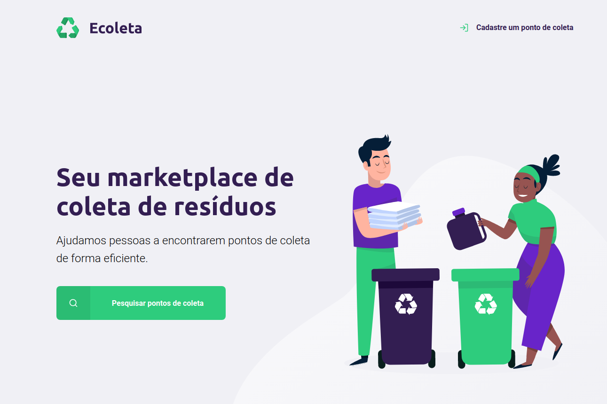

<h1 align="center">
ECOLETA

 
<h1>

## Sobre

Projeto criado durante a Next Level Week [Rocketseat](https://rocketseat.com.br/).
Aplicação foi desenvolvida utilizando javascript.

## Como executar o projeto

Para executar o projeto é necessário ter instalado o [NodeJs](https://nodejs.org/en/) e recomendamos a utilização do [Yarn](https://classic.yarnpkg.com/pt-BR/docs/install/)

Clonar o repositório
```bash
$ git clone git@github.com:felipepassosdev/devhipster.git
```
Acessar o diretório clonado
```bash
$ cd devhipster
```
Instalar as dependencias
```bash
$ yarn

ou

$ npm install
```
Executar o projeto
```bash
$ yarn start

ou

$ npm run start
```